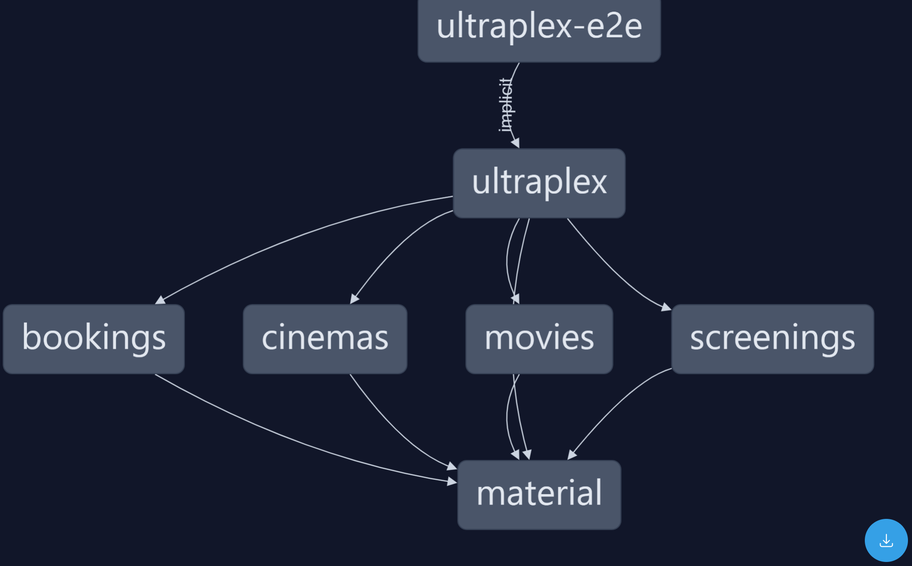

# Ultraplex Cinemas

This project was generated using [Nx](https://nx.dev).

## Tech Stack

- Angular
- NgRx
- Angular Material
- Nx
- Jest
- Cypress

## Module Dependency Graph



✨ **This workspace has been generated by [Nx, a Smart, fast and extensible build system.](https://nx.dev)** ✨

## Start the app

To start the development server run `nx serve ultraplex`. Open your browser and navigate to http://localhost:4200/. Happy coding!

## Generate code

If you happen to use Nx plugins, you can leverage code generators that might come with it.

Run `nx list` to get a list of available plugins and whether they have generators. Then run `nx list <plugin-name>` to see what generators are available.

Learn more about [Nx generators on the docs](https://nx.dev/plugin-features/use-code-generators).

## Running tasks

To execute tasks with Nx use the following syntax:

```
nx <target> <project> <...options>
```

You can also run multiple targets:

```
nx run-many -t <target1> <target2>
```

..or add `-p` to filter specific projects

```
nx run-many -t <target1> <target2> -p <proj1> <proj2>
```

Targets can be defined in the `package.json` or `projects.json`. Learn more [in the docs](https://nx.dev/core-features/run-tasks).

## Outstanding tasks

- Pagination
- Add a new screening for a specific movie and screen
- Add a new booking for a specific screening and the number of seats


- Cypress E2E tests
